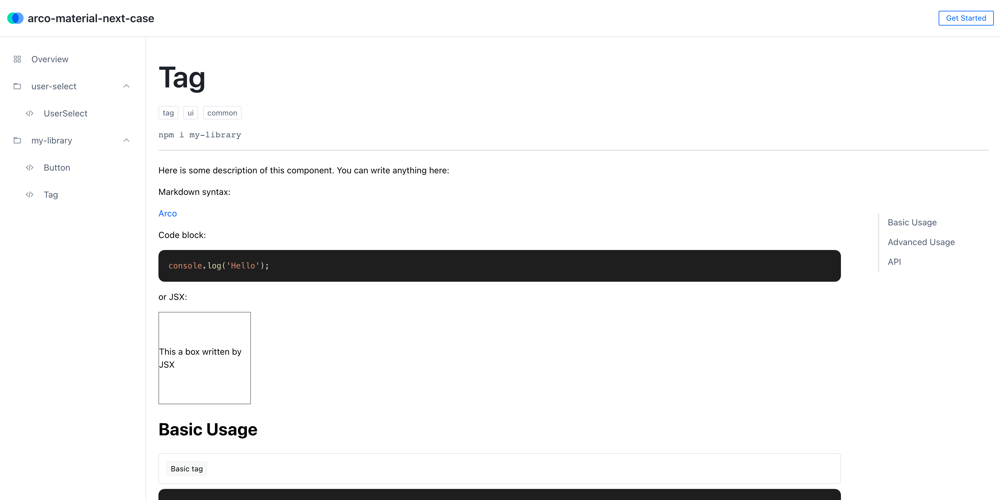

# arco-cli@next

`arco-cli@2.x` 的预览项目。

## 快速开始

1. 克隆此项目后，使用 `npm install` 或者 `yarn` 或者 `pnpm i` 安装依赖。
2. `yarn start` 本地运行工作区。

## 配置入口

`arco.workspace.jsonc` 是工作区配置文件，这里可以配置当前工作区的组件列表，以及针对组件的不同配置。

```json
{
  "arco.aspect/workspace": {
    "components": {
      "extends": {
        "author": "MisterLuffy",
        "group": 1,
        "entries": {
          "base": ".",
          "main": "./index.ts",
          "style": "./style/index.less",
          "jsdoc": "./interface.ts",
          "preview": "./__docs__/index.mdx"
        }
      },
      "members": [
        {
          "name": "UserSelect",
          "rootDir": "packages/user-select/src"
        },
        {
          "name": "Button",
          "rootDir": "packages/library/components",
          "entries": {
            "base": "./Button"
          }
        },
        {
          "name": "Tag",
          "rootDir": "packages/library/components",
          "entries": {
            "base": "./Tag"
          }
        }
      ]
    }
  }
}
```

配置文件的根节点名称为 AspectID，关于工作区组件的配置位于 `root['arco.aspect/workspace']` 字段下。其字段的含义如下：

* `components`: 组件描述入口；
  * `extends`: 组件配置的默认值；
  * `members`: 组件配置；
    * `name`: 组件名，并由 `packageName/name` 构成组件 ID；
    * `rootDir`: 构建入口，不同于 NPM 包根路径（通常为 `src`）；
    * `author`: 作者 ID（物料平台的用户 ID）；
    * `group`: 物料所属团队（物料平台的团队 ID）；
    * `entries`: 关键文件信息；
      * `base`: 源码目录（默认为 `./`，在组件库类型的包中可能形如 `./components`）；
      * `main`: 主入口（相对于 `base`）；
      * `style`: 样式主入口（相对于 `base`）；
      * `jsdoc`: API 文档解析的入口（相对于 `base`）；
      * `preview`: 预览入口（相对于 `base`）；

**关于单包组件和组件库（单包多组件）的说明：**

我们调整了物料平台中的物料与 NPM 包的映射关系，物料与 NPM 包之间不再存在强制的一一映射关系，而是以 `{npm-package-name}/ComponentName` 的形式生成唯一的组件 ID。如此，组件库将在物料平台上对应多个物料。

以此 Demo 为例，`packages` 中存在两个 NPM 包 —— `user-select` 和 `my-library`，它们分别是单包组件和组件库。通过 `arco.workspace.json` 中配置，可以指定精确的物料映射关系，发布至物料平台后，这两个 NPM 包将对应三个物料：

* `user-select/UserSelect`
* `my-library/Button`
* `my-library/Tag`

## 本地调试

运行 `yarn start` 命令。将在浏览器启动下边的页面用于本地开发：



## 构建

运行 `yarn build` 命令。构建过程中主要做了下边几件事：

1. 构建 ESM 产物；
2. 构建 CommonJS 产物；
3. 为每一个组件打包预览文件，此预览文件将在物料平台物料预览时被渲染；

## 测试

运行 `yarn test` 命令。

```bash
# 指定测试某一组件
yarn test $componentID
```

## 拓展配置

在项目根目录通过 `arco.env.config.js` 拓展组件运行环境配置。目前支持拓展 Typescript、Webpack、Jest 的配置。

Typescript 和 Webpack 的配置字段允许传入一个 ConfigTransformer 数组，内部接收配置拓展函数。我们提供了 ConfigMutator 来便捷拓展配置对象。其具体类型参考：

* [TypescriptConfigMutator](https://github.com/arco-design/arco-cli/blob/next/packages/aspect/src/typescript/typescriptConfigMutator.ts)
* [WebpackConfigMutator](https://github.com/arco-design/arco-cli/blob/next/packages/aspect/src/webpack/webpackConfigMutator.ts)

```js
const path = require('path');

// 后续将通过 defineConfig 提供配置文件类型提示
module.exports = function defineConfig(envId) {
  return {
    jest: {
      // 指定 Jest 配置文件路径
      // jestConfigPath: path.resolve(__dirname, './jest.config.js'),
      // 指定 Jest 路径
      // jestModulePath: '',
    },
    webpack: {
      // 拓展本地开发预览时的 Webpack 配置
      devServerConfig: [
        (config) => {
          return config.merge({
            plugins: [],
            resolve: {},
          });
        },
      ],
      // 拓展构建预览文件时的 Webpack 配置
      previewConfig: [
        (config) => {
          return config.merge({
            plugins: [],
            resolve: {},
          });
        }
      ],
    },
    typescript: {
      // 拓展 TS 构建配置
      // 除此处配置外，如果组件 package 目录下存在 tsconfig.json，程序还将自动应用其配置
      buildConfig: [
        (config) => {
          return config.mergeTsConfig({
            compilerOptions: {
              allowJs: false,
            },
          });
        },
      ],
    },
  };
};
```

## 发布至物料平台

目前我们仍需要将物料预览产物一同发布至 NPM 以实现物料平台对其预览（依赖 UNPKG），后续将使用自建 FileServer 替代 UNPKG。因此确保 `artifacts` 目录在 NPM 发布时被作为产物一同上传。

```json
{
  "name": "my-button",
  "version": "0.1.0",
  "scripts": {
    "build": "arco build",
    "prepublishOnly": "npm run build"
  },
  "files": [
    "es",
    "lib",
    "artifacts"
  ]
}
```

通过以下步骤将物料发布至 NPM，并同步至物料平台：

```bash
# 如已登录可跳过步骤 1/2

# 1. 设置 arco-cli 使用的 Arco 域名（内网用户需要设置其为 Arco 内网域名）
arco host arco.design

# 2. 登录
arco login

# 3. 构建并发布 NPM 包
npm publish

# 4. 将物料同步至物料平台
arco sync --componentPattern $componentID
```

### 使用 Access Token

如果需要在 CI 流程中使用 Arco CLI，我们为用户提供了 Access Token 来完成鉴权。在物料平台右上角的用户头像区域获取 Access Token：


通过环境变量传入 Access Token：

```bash
ARCO_CONFIG_X_ARCO_ACCESS_TOKEN=your_access_token arco sync
```

同时你也可以通过环境变量设置 Arco 站点的域名：

```bash
ARCO_CONFIG_HOST_ARCO=arco.example.net arco sync
```
